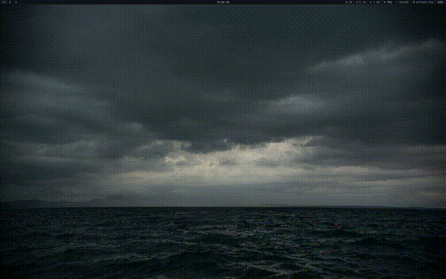

# fetch

A donut.c-inspired fetch tool that spins your distro logo in 3D with live-updating system info.



Takes any ASCII/Unicode distro logo, turns each character into a point cloud
based on its visual density, and renders it as a rotating 3D relief with
Blinn-Phong shading. System info is gathered natively from `/proc`, `/sys`,
and GTK config — no external dependencies required.

Based on [gentoo.c](https://github.com/areofyl/gentoo.c).

## Build & run

```
make
./fetch
```

Press any key to stop — the keypress passes through to the shell, so it
works as a startup fetch. Ctrl-C works too.

## Install

```
sudo make install
```

`PREFIX=~/.local make install` if you don't want it system-wide.

## Logos

By default it auto-detects your distro and grabs the logo from fastfetch
(if installed) with its original per-character colors preserved. Works with
any of fastfetch's 500+ distro logos!

You can also specify one directly:

```
./fetch -l arch
./fetch -l NixOS
./fetch -l asahi
```

Or drop a custom logo in `~/.config/fetch/logo.txt`:

```
# distro: gentoo
         -/oyddmdhs+:.
     -odNMMMMMMMMNNmhy+-`
...
```

Without fastfetch, the built-in Gentoo logo is used.

## System info

All system info is gathered natively — no fastfetch or neofetch needed:

- **OS** — `/etc/os-release`
- **Host** — `/proc/device-tree/model` or `/sys/class/dmi/id/product_name`
- **Kernel** — `uname()`
- **Uptime** — `/proc/uptime`
- **Packages** — emerge, pacman, dpkg, rpm, xbps, apk
- **Shell** — `$SHELL` + version
- **Display** — `/sys/class/drm/card*/modes`
- **WM** — env vars + process detection
- **Theme/Icons/Font** — `~/.config/gtk-3.0/settings.ini`
- **CPU** — `/proc/cpuinfo` or device-tree (Apple Silicon)
- **GPU** — DRM device uevent
- **Memory/Swap** — `/proc/meminfo`
- **Disk** — `statvfs()`
- **Battery** — `/sys/class/power_supply` (energy_now/energy_full)
- **Local IP** — `ip addr`

Stats like memory, battery, and uptime update in real-time while the logo spins.

## Config

Create `~/.config/fetch/config` to customize:

```
# fields — list to show, in this order
# remove or comment out to hide
os
host
kernel
uptime
packages
shell
display
wm
theme
icons
font
terminal
cpu
gpu
memory
swap
disk
ip
battery
locale
colors

# appearance
# label_color=magenta   (red, green, yellow, blue, magenta, cyan, white)
# separator=─           (character for the title separator)
# shading=.,-~:;=!*#$@  (characters for 3D shading, supports UTF-8)

# 3d
# light=top-left        (top-left, top-right, top, left, right, front, bottom-left, bottom-right)
# spin=xy               (x, y, or xy)
# speed=1.0             (rotation speed)
# size=1.0              (logo scale, e.g. 2.0 for double size)
# height=36             (override render height in rows)
```

## Options

| Flag | Description |
|------|-------------|
| `-l`, `--logo <name>` | Use a logo from fastfetch by name |
| `--rotate-x` | Lock rotation to X axis only |
| `--rotate-y` | Lock rotation to Y axis only |
| `-s`, `--speed <float>` | Speed multiplier (default 1.0) |
| `--size <float>` | Scale the logo (e.g. 2.0 for double size) |
| `--height <n>` | Override render height in rows |
| `--no-info` | Just the logo, no system info |
| `--no-color` | Disable coloring |
| `--frames <n>` | Stop after n frames |
| `--infinite` | Run forever |
| `--shading-chars <str>` | Custom shading ramp, supports UTF-8 |
| `-h`, `--help` | Show help |

CLI flags override config file settings.

## How it works

Each character in the logo gets a weight based on its visual density — `M` is
heavy, `.` is light, `█` is full, `░` is thin. That weight becomes a height,
turning the flat logo into a 3D relief. Surface normals come from the height
gradient, and everything gets rotated + projected + shaded every frame with a
z-buffer. Single file C, no deps beyond libm.
